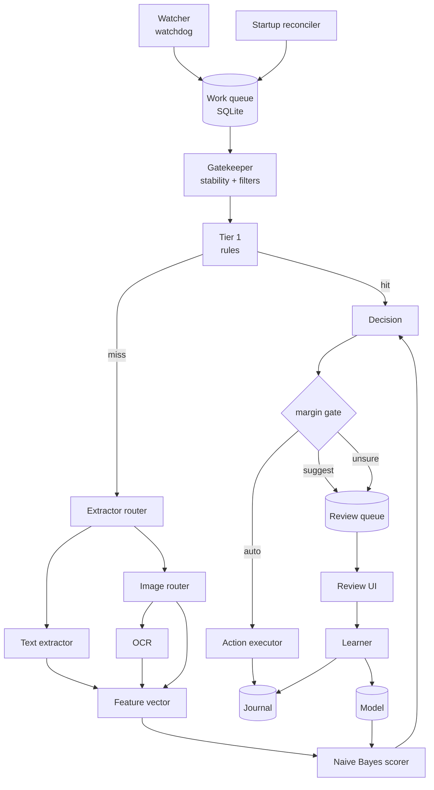
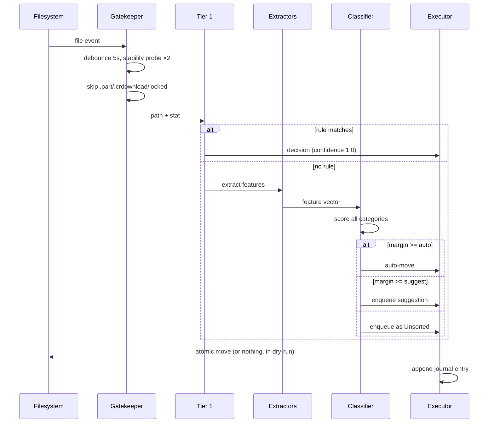
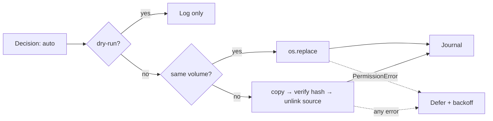

# Architecture — Local File Classifier

> **Implemented-app note (2026-08-13):** The diagrams below describe the original long-lived watcher proposal. The integrated MVP instead uses manual Desktop/Downloads collection, an in-process `QThreadPool` capped at two workers, one reusable pipeline/OCR engine per worker, and Qt signals back to the UI. See `docs/FUNCTION_MAP.md` for the implemented call graph.
>
> Each worker now runs the complete `Pipeline.safe_classify()` path and returns a reusable `AnalysisRecord` containing persisted Tier-1/Naive Bayes evidence plus extracted features. Engine categories never become destination topics automatically. A fresh install calibrates user topics from a bounded random sample; adaptive TF-IDF and optional consent-gated local Gemma labels are reviewed before profile creation. Full-batch corrections add signed positive/negative evidence only after successful moves. See `docs/HIERARCHICAL_TOPICS.md` for the implemented hierarchy.

Companion to `SRS.md`. Requirement IDs (`FR-xxx`, `NFR-xxx`) refer to that document.

---

## 1. Shape of the system

One long-lived worker process does all the work. A second, short-lived UI process exists only while a window is open. They communicate through SQLite, not through IPC.



Two things to notice. The **Learner writes only from user actions** — there is no self-training loop, because a model that learns from its own guesses drifts. And the **Journal is downstream of everything**, so any state can be rebuilt from it (NFR-403).

---

## 2. Processes and threads

| Thread | Job | Blocking allowed |
| --- | --- | --- |
| Main | Tray icon, event loop, signal handling | no |
| Watcher | `watchdog` observer, writes to queue | no |
| Worker (×1) | Gatekeeper → extraction → classification → action | yes |
| Maintenance | Pruning, calibration, journal expiry; runs on idle timer | yes |

Exactly one worker (NFR-107). Parallelism buys nothing here — the bottleneck is disk and the goal is invisibility, not throughput.

Extraction runs inside the worker but **each extractor is wrapped in a timeout guard** (FR-210). All neural inference — OCR and YOLO — runs in a short-lived **vision subprocess**, never in the main worker. ONNX Runtime's memory arenas do not fully return to the OS, so an in-process inference call permanently raises the app's idle RSS from ~80 MB to several hundred and breaks NFR-101 for the rest of the session. A subprocess that exits gives the memory back.

```
worker: batch of images → spawn vision_worker.py
                        → ORT sessions init once (~1.5s)
                        → per image: decode → route → OCR or YOLO + derived features
                        → stream JSONL results back over stdout
                        → process exits → RSS returns to 80 MB baseline
```

**Batching is required, not an optimisation** (NFR-207). Session initialisation costs about as much as inference itself, so per-image subprocess spawning triples the cost of a 200-image KakaoTalk folder. The worker accumulates image work into a batch (default: 16 images, or a 30 s timer, whichever first) and spawns once. Results stream back as JSONL so the worker can act on early results without waiting for the batch to finish.

---

## 3. The pipeline, stage by stage



### 3.1 Gatekeeper

Cheapest possible rejection first: exclusion globs → in-progress extension → size ceiling → lock probe → stability. Only survivors cost anything.

The Windows lock probe: attempt `CreateFile` with `FILE_SHARE_READ | FILE_SHARE_WRITE | FILE_SHARE_DELETE` and check for sharing violations. In Python, opening `'rb'` and catching `PermissionError` covers the common cases.

### 3.2 Tier 1

Ordered, first-match-wins rules from `rules.yaml`:

```yaml
rules:
  - id: installers
    match: {ext: [exe, msi, dmg, pkg, appimage]}
    category: Installers

  - id: kakao-export
    match: {filename_regex: '^KakaoTalk_\d{8}_\d{6}'}
    action: mark          # not a category — a hint for later tiers
    meta: [kakao_export, needs_content]

  - id: coursework
    match: {filename_regex: '(과제|report|assignment|hw\d|lab\d)'}
    action: mark
    meta: [topic_hint:coursework]

  - id: bank-statements
    match: {filename_regex: '(거래내역|명세서|statement|invoice|세금계산서)'}
    action: mark
    meta: [topic_hint:purchase]
```

Three rule outcomes: `category` (terminal engine evidence), `mark` (annotate and continue), `exclude` (drop). Semantic defaults use `mark`, never a destination topic. The KakaoTalk rule is also a `mark` — the filename tells you the *source* but nothing about the content, which is exactly why that folder is the interesting case.

Filename normalisation before regex matching:

```
KakaoTalk_20260809_123456.jpg
  → strip timestamp   → KakaoTalk_.jpg
  → split separators  → ["kakaotalk"]
  → meta              → ["kakao_export", "image", "no_exif"]
```

```
운영체제_과제3_최종본(2).pdf
  → strip counter     → 운영체제_과제3_최종본
  → split             → ["운영체제", "과제3", "최종본"]
  → morphemes         → ["운영체제", "과제", "최종본"]
  → digits stripped   → "과제3" → "과제"
```

### 3.3 Extractor router

Dispatch on sniffed MIME first, extension second — extensions lie.

| Input | Extractor | Output source tag |
| --- | --- | --- |
| PDF | `PyMuPDF` text layer; if < 100 chars extracted, treat as scanned → image path | `body` |
| DOCX | `python-docx`, or read `word/document.xml` from the zip directly | `body` |
| HWP / HWPX | `olefile` (HWP 5.0 `PrvText` stream) or zip+XML for HWPX | `body` |
| TXT / MD / CSV | direct read with encoding detection (CP949 matters for Korean files) | `body` |
| Image, screenshot | OCR (vision subprocess) | `ocr` |
| Image, photo | YOLOv8n (vision subprocess) + derived/context features | `obj`, `pair`, `meta` |
| Image, ambiguous | both paths; costs more, so keep the router good | all of the above |
| Archive | `zipfile.namelist()` — names only, never extract | `body` |
| Anything else | filename + metadata only | `filename`, `meta` |

**Screenshot vs. photo** (FR-207), in priority order:

1. EXIF `Make`/`Model` present → photo.
2. Dimensions match a known screen resolution or the device's own resolution → screenshot.
3. PNG with no EXIF → screenshot.
4. Filename hints (`Screenshot`, `화면 캡처`, `스크린샷`) → screenshot.
5. Cheap pixel heuristic: sample 5 000 pixels; screenshots have low colour entropy, large flat regions, and a strong grey/white mode. Photos do not.
6. Still unresolved → run both paths.

Both branches now cost real time, so unlike v0.1 there is no cheap default to fall back on. Step 5 exists to keep the "run both" bucket small — it costs about 15 ms and it is worth writing properly. Log the routing verdict on every image; if the "both" bucket exceeds 10 % of images in your own folders, tune the heuristic rather than accepting the cost.

### 3.4 Korean tokenisation (FR-203)

This is the part the original plan is missing, and it silently breaks everything downstream if skipped. Korean is agglutinative: `회의록에서`, `회의록을`, `회의록은` are three surface forms of one concept. Whitespace tokenisation gives you three unrelated vocabulary entries, each with a third of the evidence, and the Naive Bayes counts never accumulate.

Pipeline:

```
raw text
  → script segmentation (Hangul runs vs. Latin runs vs. digits)
  → Hangul runs: morphological analysis, keep NNG/NNP/VV/VA stems
  → Latin runs: lowercase, Porter-lite or no stemming
  → stopword filter (ko + en lists)
  → length filter (Hangul ≥ 1 char, Latin ≥ 2)
  → TF·IDF rank, keep top K
```

Pick the analyser on these criteria: pure-C++ or pure-Python (no JVM — that rules out KoNLPy's Komoran/Hannanum), pip-installable with prebuilt Windows wheels (no compiler, NFR-503), analysis of a 20 000-char document in well under 300 ms, and a license compatible with your distribution answer to Q3. `kiwipiepy` fits the technical criteria; verify its license against your distribution model before committing.

Fallback if no analyser is acceptable: character n-grams (n = 2, 3) over Hangul runs. Worse, but it degrades gracefully rather than failing silently, and it needs no dependency.

### 3.5 Vision path (Tier 2c)

**Design intent: the model never names the scene. The statistics do.**

This is the emergent-context idea from §4 of the source plan, and it is correct. Naive Bayes does not need a token that says `coffee_shop`. It needs `P(features | category)` to differ across categories. If photos you file under `공부` reliably contain `laptop`, `book`, `cup` and photos under `가족` reliably contain `person`, `cake`, `dining table`, the model separates them without any component understanding what a café is. The scene label would be a *convenience*, not a requirement.

So: **YOLOv8n only.** One model, one decode.

| Model | Input | Output | Size | Latency |
| --- | --- | --- | --- | --- |
| YOLOv8n (COCO) | 640×640 letterboxed | 80 object classes | ~12 MB ONNX | ~1.2 s |

#### The real constraint: evidence density, not label vocabulary

The risk in the object-only approach is not that COCO's labels are the wrong words. It is that **a photo yields far fewer features than a document does**, and the margin gate is normalised by evidence count (§4.3).

| Input | Typical feature count |
| --- | --- |
| PDF, 5 pages | 30 |
| Chat screenshot, OCR | 15–40 |
| Photo, YOLO at conf 0.35 | **2–5** |

With three features and twenty categories, `n_eff` sits near `MIN_EVIDENCE` and the margin rarely clears `theta_suggest`. The failure mode is not wrong answers — it is `Unsorted`, on most photos, indefinitely. That is what would kill the demo, and it is measurable before you build the UI.

Four cheap ways to raise evidence density, in order of cost:

**1. Lower the confidence floor and let weight do the filtering.** Drop `conf` from 0.35 to 0.15. A 0.2-confidence `book` is weak evidence, not zero evidence, and confidence already enters as feature count rather than as a gate. This typically doubles detections per photo for free, and it is exactly the noise-tolerance principle from §4 of the source plan applied to vision instead of OCR.

**2. Derived features from detection structure.** Counts and geometry cost nothing once the boxes exist:

```python
yield Feature(t=f"n_person:{bucket(count('person'))}", src="obj", n=1)   # 0 | 1 | 2-4 | 5+
yield Feature(t=f"n_objects:{bucket(len(dets))}",      src="obj", n=1)
yield Feature(t="subject:large" if max_box_area > 0.4 else "subject:small",
              src="obj", n=1)
```

`person×8` and `person×1` are different situations — group photo versus portrait — and the raw class list cannot tell them apart.

**3. Pair features — co-occurrence, inside Naive Bayes.** This is what your plan was actually reaching for, and I was wrong to wave it off in ADR-001. NB has no interaction term *natively*, but you can hand it one by emitting conjunctions as synthetic tokens:

```python
for a, b in combinations(sorted(top_classes[:5]), 2):
    yield Feature(t=f"pair:{a}+{b}", src="pair", n=min(conf[a], conf[b]))
```

`pair:book+laptop` is a single token that scores independently of `obj:book` and `obj:laptop`. The model learns that the conjunction is more indicative than either part, which is precisely the `book` alone is ambiguous / `book + laptop + coffee` is not distinction from your §4. Five detections yield ten pairs, so evidence density roughly triples. The cost is vocabulary growth, bounded by capping at the top 5 classes and by the existing pruning rule (FR-406).

**4. Near-free non-visual features.** Orthogonal to objects, so they add real information rather than correlated noise:

```
exif:has_gps, exif:camera_present, exif:hour_bucket    (morning|day|evening|night)
color:warm | color:cool, color:indoor | color:outdoor  (from a 5000-px sample)
aspect:portrait | landscape | square
img:screenshot_score                                    (reused from the router)
```

Time of day alone separates `여행` from `업무` surprisingly well, and it costs one EXIF read.

#### Post-processing

```python
dets = nms(raw, iou=0.45, conf=0.15)

for cls, group in group_by_class(dets):
    yield Feature(t=f"obj:{cls}", src="obj",
                  n=min(len(group), 3) * mean(d.conf for d in group))

for a, b in combinations(sorted(top_classes(dets, k=5)), 2):
    yield Feature(t=f"pair:{a}+{b}", src="pair", n=min(conf[a], conf[b]))

yield from derived_features(dets)     # counts, geometry
yield from context_features(path)     # exif, colour, aspect
```

Three choices worth understanding:

- **Confidence enters as feature count, not as a filter.** A 0.2-confidence `dog` contributes less than a 0.95-confidence `dog` rather than being discarded. Same mechanism as the OCR downweight in §4.1.
- **Count capping at 3.** Fifteen `person` boxes in a group photo is not fifteen times the evidence of one; uncapped, crowd photos swamp everything else. The count *bucket* feature carries the "many people" signal instead.
- **Namespaced tokens** (`obj:dog`, `pair:book+laptop`) so vocabulary never collides across sources, and per-source weights and debugging stay legible.

Store the raw detection list in `decisions.explanation` — it is what you show next to the thumbnail, and it is the most legible part of the system to a non-technical judge.

#### When to add a scene classifier

Not now. Decide it with your own data instead of by argument. After M0 and step 14, run:

```sql
SELECT AVG(n_eff), 
       SUM(action='unsorted')*1.0/COUNT(*) AS unsorted_rate
FROM decisions WHERE tier='t2c';
```

If `unsorted_rate` stays above ~0.30 after 30 corrections per photo category, object features are too sparse and a Places365 MobileNetV3 (~10 MB, ~150 ms, 365 dense scene labels) is the cheapest fix — it adds three high-entropy features per image at a tenth of YOLO's cost. If the rate is below that, you have proven the stronger version of your thesis and the scene model would only be redundant weight. Either outcome is a good slide.

### 3.6 Feature vector

```json
{
  "file_id": "sha1:9c1f...",
  "path": "C:/Users/me/Documents/카카오톡 받은 파일/KakaoTalk_20260809_123456.jpg",
  "size": 1284119,
  "partial": false,
  "route": "photo",
  "features": [
    {"t": "obj:cup",              "src": "obj",   "n": 1.74},
    {"t": "obj:laptop",           "src": "obj",   "n": 0.91},
    {"t": "obj:book",             "src": "obj",   "n": 0.88},
    {"t": "obj:person",           "src": "obj",   "n": 0.95},
    {"t": "obj:chair",            "src": "obj",   "n": 0.41},
    {"t": "pair:book+laptop",     "src": "pair",  "n": 0.88},
    {"t": "pair:cup+laptop",      "src": "pair",  "n": 0.91},
    {"t": "pair:book+cup",        "src": "pair",  "n": 0.88},
    {"t": "n_person:1",           "src": "obj",   "n": 1},
    {"t": "n_objects:5+",         "src": "obj",   "n": 1},
    {"t": "exif:hour_bucket:day", "src": "meta",  "n": 1},
    {"t": "color:indoor",         "src": "meta",  "n": 1},
    {"t": "kakao_export",         "src": "meta",  "n": 1},
    {"t": "jpg",                  "src": "ext",   "n": 1}
  ],
  "extracted_at": "2026-08-10T09:12:44Z",
  "extractor_ms": {"decode": 41, "yolo": 1180, "derived": 6},
  "peak_rss_mb": 341
}
```

Five raw detections become fourteen features. Nothing in this vector names a café, and nothing needs to — `pair:book+laptop` plus `pair:cup+laptop` plus `color:indoor` is a statistical fingerprint that separates cleanly from a `가족` photo's `person×5 + cake + dining table`, once you have filed twenty of each.

`extractor_ms` and `peak_rss_mb` are the raw material for NFR-111 and for the contest chart. Record them from the start.

---

## 4. Classifier

### 4.1 Scoring

Multinomial Naive Bayes in log space (ADR-001):

```
score(c) = log P(c)
         + Σ_features  w_src(f) · n_f · log( (count(f, c) + α) / (total(c) + α·|V|) )
```

- `α` = 0.3 (Lidstone; less aggressive than Laplace α=1 on small vocabularies)
- `w_src` = source weights, config-tunable. Starting point:

| Source | Weight | Why |
| --- | --- | --- |
| `filename` | 3.0 | user-chosen, high signal density |
| `meta` | 2.0 | structural, never noisy |
| `pair` | 1.5 | conjunctions are more indicative than their parts — that is the whole point of emitting them |
| `body` | 1.0 | baseline |
| `obj` | 0.8 | individually weak; confidence already folded into `n` |
| `ocr` | 0.6 | noisy; downweight rather than trust equally |

Pair features are partly redundant with their constituent object features, which formally violates NB's independence assumption. That is fine in practice — NB is routinely used with correlated features and its *ranking* stays useful even when its posteriors are miscalibrated, which is why the decision gate uses margin rather than probability (§4.3). The 1.5 weight rather than something higher is the hedge: pairs get to matter without letting a single visual motif triple-count itself.

The OCR downweight is how the plan's noise-tolerance claim actually gets implemented. `Transfr` contributes a small mis-weighted term while `Bank`, `Account`, `Balance` each contribute a full one — the tolerance comes from the sum, exactly as the plan argues, but only if OCR tokens aren't allowed to dominate on volume.

### 4.2 Unknown tokens

A token absent from the model contributes `log(α / (total(c) + α·|V|))` to *every* category — identical across categories, so it cancels in the margin. Skip it in the loop rather than computing it. This is why the margin gate, not the absolute score, is the right signal.

### 4.3 Decision gate (FR-304)

```python
scores = sorted(score(c) for c in categories, reverse=True)
n_eff  = sum(w_src(f) * n_f for f in features)   # effective evidence count
margin = (scores[0] - scores[1]) / max(n_eff, 1)

if n_eff < MIN_EVIDENCE:        # too few features to trust anything
    return UNSORTED
if margin >= theta_auto:        return AUTO_MOVE
if margin >= theta_suggest:     return SUGGEST
return UNSORTED
```

Normalising by evidence count is what makes thresholds comparable across a 3-token filename and a 30-token PDF. Raw log-odds scale with document length and would auto-move every long document and defer every short one.

Starting values: `theta_auto = 0.55`, `theta_suggest = 0.15`, `MIN_EVIDENCE = 3`. These are guesses — calibrate them against the eval corpus in M0, then per-user in FR-407.

### 4.4 Explanation

Contribution per feature is its term in the sum, differenced against the runner-up category:

```
contrib(f) = w_src(f) · n_f · [ log P(f|c1) − log P(f|c2) ]
```

Sort by absolute value, keep 8, store with the decision (FR-305). This is nearly free and it is the entire basis of user trust in the tool.

---

## 5. Learning

### 5.1 Bootstrap (FR-401)

The single highest-leverage feature, and the one the source plan omits. The user's existing organised folders are a labelled training set that already exists.

```
for each subdirectory of the destination root (= a category):
    sample up to 200 files, stratified by extension
    extract features (Tier 2a only — never OCR during bootstrap; it would take hours)
    add counts to that category
hold out 20% for an immediate accuracy readout shown to the user
```

Report the held-out number in the wizard. It sets honest expectations and it tells you whether their taxonomy is even separable.

### 5.2 Seed lexicon (FR-402)

Superseded in the manual MVP. No semantic seed lexicon is shipped, because it would silently impose destination topics. A fresh topic store is empty; only user-created profiles and explicitly named/approved proposals or migrations may select a topic.

### 5.3 Feedback (FR-403, FR-404)

```python
def apply_feedback(vector, predicted, chosen):
    deltas = []
    for f in vector.features:
        deltas.append((f.t, chosen, +f.n))
        if predicted and predicted != chosen:
            deltas.append((f.t, predicted, -f.n * DEMOTE))   # DEMOTE = 0.5
    model.apply(deltas)
    journal.record_model_deltas(vector.file_id, deltas)
```

Counts floor at zero. `DEMOTE = 0.5` rather than 1.0 because a single correction is often context-specific — a user filing one invoice under `Tax` doesn't mean `invoice` never means `Work`. Two corrections should flip a term; one should only nudge it.

Recording deltas is what makes FR-405 possible: undoing a move subtracts exactly what that move's feedback added.

### 5.4 Calibration (FR-407)

Once ≥ 50 labelled decisions exist, sweep `theta_auto` over the recorded `(margin, was_correct)` history and pick the lowest threshold whose precision stays above the configured floor (default 97 %). Re-run weekly. This adapts to the user: someone with well-separated categories gets aggressive automation, someone with overlapping ones gets more suggestions, and neither has to touch a slider.

---

## 6. Storage

Two files, two jobs. JSON for the model (inspectable, portable, matches the plan's philosophy). SQLite for everything with concurrency or queries.

```
%APPDATA%/tidy/
  config.yaml               user settings
  rules.yaml                Tier 1 rules
  seed_lexicon.yaml         shipped, user-editable
  stopwords.ko.txt
  stopwords.en.txt
  classifier_weights.json   the model
  df_table.json             document frequencies for IDF
  state.db                  queue, index, journal, decisions
  logs/
  models/                   OCR models, downloaded on first enable
```

### 6.1 `classifier_weights.json`

```json
{
  "version": 3,
  "updated_at": "2026-08-10T09:12:44Z",
  "categories": {
    "UserSignalA": {"docs": 142, "total": 3891},
    "UserSignalB": {"docs":  88, "total": 2140}
  },
  "tokens": {
    "token_a": {"UserSignalA": 41, "UserSignalB": 3},
    "token_b": {"UserSignalB": 67},
    "token_c": {"UserSignalA": 33, "UserSignalB": 8}
  },
  "params": {"alpha": 0.3, "theta_auto": 0.55, "theta_suggest": 0.15}
}
```

Sparse by construction — only non-zero counts stored. At the 30 000-token cap (FR-406) with typical sparsity this is 2–5 MB, loads in well under 100 ms, and stays fully human-readable. Write atomically: temp file → `fsync` → `os.replace` (NFR-402).

### 6.2 `state.db`

```sql
CREATE TABLE queue (
  id          INTEGER PRIMARY KEY,
  path        TEXT NOT NULL,
  enqueued_at TEXT NOT NULL,
  attempts    INTEGER DEFAULT 0,
  state       TEXT DEFAULT 'pending',   -- pending|working|done|deferred|failed
  not_before  TEXT                       -- backoff for locked files
);

CREATE TABLE seen (
  path     TEXT PRIMARY KEY,
  mtime    REAL NOT NULL,
  size     INTEGER NOT NULL,
  file_id  TEXT,
  seen_at  TEXT NOT NULL
);

CREATE TABLE decisions (
  id           INTEGER PRIMARY KEY,
  file_id      TEXT NOT NULL,
  path         TEXT NOT NULL,
  tier         TEXT NOT NULL,            -- t1|t2a|t2b|t3
  predicted    TEXT,
  margin       REAL,
  n_eff        REAL,
  action       TEXT NOT NULL,            -- auto|suggest|unsorted|dryrun
  features     TEXT NOT NULL,            -- JSON feature vector
  explanation  TEXT,                     -- JSON top-8 contributions
  created_at   TEXT NOT NULL
);

CREATE TABLE journal (
  id           INTEGER PRIMARY KEY,
  decision_id  INTEGER REFERENCES decisions(id),
  op           TEXT NOT NULL,            -- move|learn|undo
  src          TEXT,
  dst          TEXT,
  model_deltas TEXT,                     -- JSON, for exact reversal
  reversible   INTEGER DEFAULT 1,
  created_at   TEXT NOT NULL
);

CREATE TABLE review_queue (
  decision_id INTEGER PRIMARY KEY REFERENCES decisions(id),
  resolved_at TEXT,
  resolution  TEXT                       -- accepted|corrected|skipped
);

CREATE INDEX idx_queue_state    ON queue(state, not_before);
CREATE INDEX idx_journal_time   ON journal(created_at);
CREATE INDEX idx_decisions_file ON decisions(file_id);
```

`decisions.features` is retained so that an undo can reverse learning exactly, and so the eval harness can re-score historical files against a new model without re-extracting. It is also the sensitive part of the store (FR-703) — it is a keyword index of the user's documents.

---

## 7. Action executor



Rules that are non-negotiable:

- **Collision:** never overwrite. Suffix ` (2)`, ` (3)` (FR-502).
- **Cross-volume:** copy, hash-verify, then unlink. If verification fails, keep both and journal a failure (FR-501).
- **Locked:** defer with exponential backoff, 5 attempts, then route to `Unsorted` (FR-506).
- **Cloud-sync folders:** detect OneDrive / Dropbox / Google Drive roots and refuse to move unless explicitly enabled (FR-505). Moving files inside a syncing folder generates delete+create events upstream and can look like data loss to the user's other devices.
- **No delete path exists** (FR-507). Not for duplicates, not for junk, not ever.

Undo restores the source path, reverses the model deltas, and marks the journal entry consumed.

---

## 8. Repository layout

```
tidy/
├── docs/AGENTS.md               repository agent conventions
├── SRS.md
├── ARCHITECTURE.md
├── THIRD_PARTY.md
├── pyproject.toml
├── src/tidy/
│   ├── app.py                   tray, lifecycle, wiring
│   ├── config.py                schema + load/validate/defaults
│   ├── watch/
│   │   ├── observer.py          watchdog wrapper, debounce
│   │   ├── reconcile.py         startup catch-up scan
│   │   └── gate.py              stability, locks, exclusions
│   ├── extract/
│   │   ├── router.py            MIME sniff → extractor
│   │   ├── base.py              Extractor protocol, timeout guard
│   │   ├── text.py              pdf, docx, hwp, txt
│   │   ├── image.py             screenshot/photo routing, EXIF, entropy
│   │   ├── vision_worker.py     subprocess entry: OCR + YOLO
│   │   ├── vision/
│   │   │   ├── session.py       ORT sessions, init once per batch
│   │   │   ├── yolo.py          letterbox, NMS, class → feature
│   │   │   ├── derive.py        pairs, count buckets, geometry
│   │   │   ├── context.py       exif, colour, aspect ratio
│   │   │   └── ocr.py
│   │   ├── archive.py
│   │   └── tokenize/
│   │       ├── korean.py        morphological analysis
│   │       ├── latin.py
│   │       └── normalize.py     filename splitting, timestamp strip
│   ├── classify/
│   │   ├── tier1.py             rules engine
│   │   ├── model.py             NB model: load, score, apply deltas
│   │   ├── gate.py              margin thresholds
│   │   ├── explain.py           contribution ranking
│   │   └── calibrate.py         threshold sweep
│   ├── learn/
│   │   ├── bootstrap.py         learn from existing folders
│   │   ├── seed.py              lexicon → pseudo-counts
│   │   └── feedback.py          accept/correct → deltas
│   ├── act/
│   │   ├── executor.py          moves
│   │   ├── journal.py           append + undo
│   │   └── collision.py
│   ├── store/
│   │   ├── db.py                schema, migrations
│   │   └── modelfile.py         atomic JSON read/write
│   └── ui/
│       ├── tray.py
│       ├── review.py
│       └── settings.py
├── data/
│   ├── seed_lexicon.yaml
│   ├── stopwords.ko.txt
│   ├── stopwords.en.txt
│   ├── df_seed.json
│   └── rules.default.yaml
├── eval/
│   ├── corpus/                  labelled files (gitignored)
│   ├── labels.csv
│   ├── run_eval.py
│   └── report.py
└── tests/
    ├── fixtures/                small real files, incl. Korean
    ├── test_gate.py
    ├── test_tokenize_korean.py
    ├── test_model.py
    ├── test_executor.py
    └── test_end_to_end.py
```

---

## 9. Build order

Each step is independently testable. Don't skip ahead.

| # | Step | Verify by |
| --- | --- | --- |
| 1 | `eval/` harness + labelled corpus | `run_eval.py` produces a precision/coverage table from a stub classifier |
| 2 | `store/` schema + `modelfile` atomic writes | kill -9 during write, model still loads |
| 3 | `watch/` + `gate` | drop 50 mixed files, all enqueued once; partial downloads skipped |
| 4 | `act/executor` in dry-run + `journal` | logs correct destinations, moves nothing |
| 5 | `classify/tier1` | eval shows rules coverage % |
| 6 | `extract/tokenize/korean` | `회의록에서`/`회의록을` → same token; 20k chars < 300 ms |
| 7 | `extract/text` | all fixture formats yield sane top-30 tokens |
| 8 | `classify/model` + `gate` + `seed` | eval NFR-302 on the document subset |
| 9 | `learn/bootstrap` | held-out accuracy ≥ 70 % on a real tree |
| 10 | `learn/feedback` + undo | 50 simulated corrections improve eval accuracy; undo restores exactly |
| 11 | `extract/image` router | screenshot/photo verdict correct on ≥ 95 % of your own images |
| 12 | `vision_worker` + `vision/session` batching | 16 images init ORT once; RSS returns to 80 MB after exit |
| 13 | `vision/ocr` | NFR-204; Korean chat screenshot yields ≥ 10 tokens |
| 14 | `vision/yolo` + `vision/derive` + `vision/context` | NFR-205; median `n_eff` on photos ≥ 10; KakaoTalk folder sorts end-to-end |
| 15 | `ui/` tray + review queue with thumbnails and detected tags | you use it daily |
| 16 | `calibrate` | thresholds move sensibly on synthetic accept/correct histories |
| 17 | Demo materials | resource chart from real `decisions` data; 3-min walkthrough rehearsed |

Steps 11–14 are the demo. If the schedule slips, they move *up*, not out — a polished text classifier with no vision path does not show a judge anything they haven't seen before.

---

## 10. Testing

**Unit.** Tokenisation (Korean particles, mixed script, CP949 encoding), filename normalisation, collision naming, margin gate arithmetic, delta application and reversal.

**Property-based.** `apply_feedback` then `reverse_feedback` returns the model to its exact prior state, for any vector. Move then undo returns the filesystem to its exact prior state, for any path.

**Fault injection.** Corrupt PDFs, zero-byte files, files deleted mid-processing, files locked mid-move, the watched directory unmounted, disk full during a cross-volume copy, `kill -9` at each pipeline stage.

**Resource regression.** Automated: process 200 files, assert peak RSS and post-run idle RSS against NFR-101/103/104/106. Run in CI. This is the requirement most likely to silently regress, because every new dependency costs memory and none of them announce it.

**Network isolation.** End-to-end run with all outbound connections blocked (FR-701). Must pass.

**Eval.** `run_eval.py` on the labelled corpus, reporting precision at `theta_auto`, coverage, top-1 accuracy, per-tier escalation rates, and a confusion matrix. Run on every classifier change. A change that improves accuracy while dropping precision below the floor is a regression.

---

## 11. Deferred interfaces

Defined now, implemented later, so nothing has to be restructured to add them.

**Tier 3 (FR-307).**

```python
class Classifier(Protocol):
    def classify(self, vector: FeatureVector,
                 candidates: list[str]) -> Decision | None: ...
```

The eventual local-LLM backend receives the *feature vector*, not the file — it sees maybe 200 tokens, so a small quantised model can run with a tiny context. Register it in the pipeline as a scorer after `tier2`, gated on config.

Every extractor, including the vision ones, implements one protocol, so adding a model later means registering one class in `extract/router.py`:

```python
class Extractor(Protocol):
    def supports(self, mime: str, path: Path) -> bool: ...
    def extract(self, path: Path, timeout: float) -> list[Feature]: ...
```

---

## 12. Demo instrumentation

The contest argument is quantitative, so the numbers have to come from the running system rather than from a slide you wrote by hand.

`decisions` already stores `tier`, `extractor_ms`, and `peak_rss_mb` per file (NFR-111). Three queries produce three slides:

**Tier distribution.** `SELECT tier, COUNT(*) FROM decisions GROUP BY tier` — the headline. If 70 % of files resolve at Tier 1 or 2a, you have shown that most file classification never needs a neural network at all, which is the entire thesis.

**Time-integrated memory.** Plot RSS over a run that processes 200 mixed files. The curve spikes to ~600 MB during vision batches and returns to 80 MB between them. Overlay a flat 2 GB line for a resident quantised 2B VLM. The area between the curves is the argument, and it is much more persuasive than a peak-vs-peak comparison that flatters the VLM.

**Latency by tier.** Box plot of `extractor_ms` grouped by tier, log scale. Shows the waterfall doing its job: the expensive path runs rarely.

Build these as a script in `eval/report.py` that reads the live database, so they regenerate with one command the morning of the presentation.
